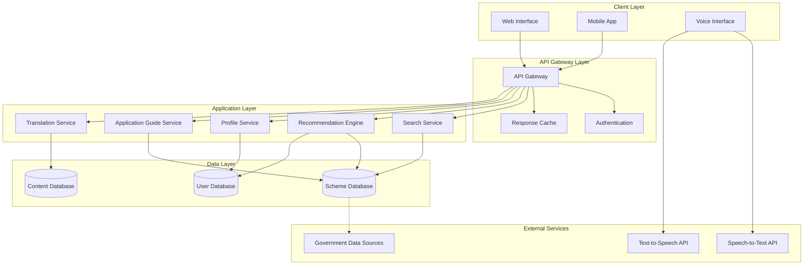

# Design Document: CivicBridge AI

## Overview

CivicBridge AI is a multilingual, AI-powered community assistant platform designed to bridge the information gap between underserved communities and government schemes. The system architecture prioritizes accessibility, low-bandwidth operation, and multilingual support to serve rural students, farmers, low-income families, senior citizens, and job seekers.

The platform consists of several key components:
- A web and mobile frontend with voice interaction capabilities
- A recommendation engine powered by profile-based matching algorithms
- A multilingual content management system with translation services
- A scheme database with search and filtering capabilities
- Low-bandwidth optimization layer for rural connectivity
- Offline-capable mobile application with data synchronization

The design emphasizes progressive enhancement, allowing users with varying levels of connectivity and device capabilities to access core functionality.

## Architecture

### System Architecture



### Component Responsibilities

**Client Layer:**
- Web Interface: Browser-based access with responsive design
- Mobile App: Native Android application with offline capabilities
- Voice Interface: Speech input/output handling with language detection

**API Gateway Layer:**
- API Gateway: Request routing, rate limiting, and protocol translation
- Authentication: User identity verification and session management
- Response Cache: Frequently accessed data caching for performance

**Application Layer:**
- Search Service: Full-text search and filtering across schemes
- Recommendation Engine: Profile-based scheme matching and ranking
- Profile Service: User data management and preference storage
- Application Guide Service: Step-by-step application instruction generation
- Translation Service: Content translation and language management

**Data Layer:**
- Scheme Database: Government program information and metadata
- User Database: User profiles, preferences, and saved schemes
- Content Database: Translated content and multilingual resources

## Components and Interfaces

### Search Service

**Purpose:** Provides full-text search and filtering capabilities across the scheme database.

**Interface:**
```
SearchService {
  searchSchemes(query: String, filters: FilterCriteria, language: Language): SchemeResult[]
  getSchemeById(schemeId: String, language: Language): SchemeDetail
  getSuggestions(partialQuery: String, language: Language): String[]
  filterSchemes(filters: FilterCriteria): SchemeResult[]
}

FilterCriteria {
  categories: String[]
  locations: String[]
  eligibilityAttributes: Map<String, Any>
  deadlineRange: DateRange
  benefitRange: ValueRange
}

SchemeResult {
  id: String
  name: String
  category: String
  summary: String
  deadline: Date
  relevanceScore: Float
}

SchemeDetail {
  id: String
  name: String
  description: String
  category: String
  eligibility: EligibilityCriteria
  benefits: String[]
  deadline: Date
  requiredDocuments: Document[]
  applicationProcedure: String
  contactInfo: ContactInfo
}
```

**Key Operations:**
- Full-text search with language-specific tokenization
- Multi-criteria filtering with AND/OR logic
- Relevance ranking based on query match and deadline proximity
- Autocomplete suggestions for search queries

### Recommendation Engine

**Purpose:** Matches users with relevant schemes based on their profile attributes.

**Interface:**
```
RecommendationEngine {
  getRecommendations(userProfile: UserProfile, limit: Int): Recommendation[]
  explainRecommendation(schemeId: String, userProfile: UserProfile): Explanation
  findEligibilityGaps(userProfile: UserProfile, schemeId: String): Gap[]
}

UserProfile {
  userId: String
  age: Int
  location: Location
  incomeLevel: IncomeCategory
  education: EducationLevel
  occupation: String
  familySize: Int
  disabilities: String[]
  preferences: Preferences
}

Recommendation {
  scheme: SchemeDetail
  matchScore: Float
  matchReasons: String[]
  urgency: UrgencyLevel
  estimatedBenefit: Value
}

Explanation {
  matchingCriteria: String[]
  missingCriteria: String[]
  recommendations: String[]
}
```

**Matching Algorithm:**
1. Extract eligibility criteria from scheme
2. Compare each criterion against user profile attributes
3. Calculate match score based on satisfied criteria (weighted)
4. Apply urgency boost for approaching deadlines
5. Rank by combined score and return top N recommendations

**Scoring Formula:**
```
matchScore = (satisfiedCriteria / totalCriteria) * criteriaWeight + urgencyBoost
urgencyBoost = max(0, 1 - (daysUntilDeadline / 30)) * 0.2
```

### Profile Service

**Purpose:** Manages user profiles, preferences, and saved schemes.

**Interface:**
```
ProfileService {
  createProfile(profileData: ProfileData): UserProfile
  updateProfile(userId: String, updates: ProfileData): UserProfile
  getProfile(userId: String): UserProfile
  saveScheme(userId: String, schemeId: String): void
  getSavedSchemes(userId: String): SchemeDetail[]
  updatePreferences(userId: String, preferences: Preferences): void
}

ProfileData {
  age: Int
  location: Location
  incomeLevel: IncomeCategory
  education: EducationLevel
  occupation: String
  familySize: Int
  disabilities: String[]
}

Preferences {
  language: Language
  voiceEnabled: Boolean
  lowBandwidthMode: Boolean
  notificationSettings: NotificationSettings
}
```

**Data Security:**
- All personally identifiable information encrypted at rest
- Profile data transmitted over HTTPS only
- User consent required for data collection
- Option to delete profile and all associated data

### Translation Service

**Purpose:** Handles content translation and multilingual support.

**Interface:**
```
TranslationService {
  translate(content: String, fromLang: Language, toLang: Language): String
  translateScheme(scheme: SchemeDetail, toLang: Language): SchemeDetail
  getAvailableLanguages(): Language[]
  cacheTranslation(key: String, language: Language, translation: String): void
}

Language {
  code: String  // "en", "hi", "kn"
  name: String
  nativeName: String
}
```

**Translation Strategy:**
- Pre-translate all scheme content into supported languages
- Cache translations in Content Database
- Fall back to English if translation unavailable
- Use translation API for user-generated content
- Preserve formatting and structure during translation

### Voice Interface

**Purpose:** Enables speech-based interaction for accessibility.

**Interface:**
```
VoiceInterface {
  speechToText(audioData: AudioStream, language: Language): String
  textToSpeech(text: String, language: Language): AudioStream
  detectLanguage(audioData: AudioStream): Language
  validateSpeechQuality(audioData: AudioStream): QualityScore
}

AudioStream {
  data: Bytes
  format: AudioFormat
  sampleRate: Int
}

QualityScore {
  score: Float  // 0.0 to 1.0
  noiseLevel: Float
  clarity: Float
}
```

**Voice Processing Pipeline:**
1. Capture audio input from user
2. Validate audio quality (check for excessive noise)
3. Detect language if not specified
4. Convert speech to text using STT API
5. Process text query through normal flow
6. Convert response text to speech using TTS API
7. Stream audio response to user

### Application Guide Service

**Purpose:** Generates step-by-step application instructions for schemes.

**Interface:**
```
ApplicationGuideService {
  generateGuide(schemeId: String, userProfile: UserProfile): ApplicationGuide
  markStepComplete(userId: String, schemeId: String, stepId: String): void
  getProgress(userId: String, schemeId: String): Progress
}

ApplicationGuide {
  schemeId: String
  steps: ApplicationStep[]
  estimatedTime: Duration
  difficulty: DifficultyLevel
}

ApplicationStep {
  stepId: String
  order: Int
  title: String
  description: String
  requiredDocuments: Document[]
  location: Location
  contactInfo: ContactInfo
  tips: String[]
  completed: Boolean
}

Progress {
  totalSteps: Int
  completedSteps: Int
  currentStep: ApplicationStep
  percentComplete: Float
}
```

### Low-Bandwidth Optimization Layer

**Purpose:** Reduces data transfer for users with limited connectivity.

**Strategies:**
- Response compression using gzip/brotli
- Image optimization and lazy loading
- Pagination with small page sizes
- Minimal JSON payloads (exclude unnecessary fields)
- Progressive content loading (text first, media later)
- Aggressive caching with long TTLs
- Delta updates for profile synchronization

**Bandwidth Budget:**
- Basic query: < 100KB
- Scheme detail: < 50KB
- Profile update: < 20KB
- Voice query: < 200KB (compressed audio)

## Data Models

### Scheme Model

```
Scheme {
  id: String (UUID)
  name: Map<Language, String>
  description: Map<Language, String>
  category: SchemeCategory
  eligibility: EligibilityCriteria
  benefits: Map<Language, String[]>
  benefitValue: ValueRange
  deadline: Date
  applicationDeadline: Date
  requiredDocuments: Document[]
  applicationProcedure: Map<Language, String>
  contactInfo: ContactInfo
  targetAudience: String[]
  locations: Location[]
  status: SchemeStatus
  createdAt: Timestamp
  updatedAt: Timestamp
}

SchemeCategory {
  SCHOLARSHIP
  HEALTH_PROGRAM
  JOB_OPPORTUNITY
  WELFARE_PROGRAM
  AGRICULTURAL_SUPPORT
  HOUSING_SCHEME
  SKILL_DEVELOPMENT
}

EligibilityCriteria {
  minAge: Int
  maxAge: Int
  incomeLimit: Value
  educationRequirement: EducationLevel
  locationRequirement: Location[]
  occupationRequirement: String[]
  otherCriteria: Map<String, Any>
}

Document {
  name: Map<Language, String>
  description: Map<Language, String>
  required: Boolean
  format: String
}

SchemeStatus {
  ACTIVE
  EXPIRED
  UPCOMING
  SUSPENDED
}
```

### User Model

```
User {
  id: String (UUID)
  phoneNumber: String (encrypted)
  email: String (encrypted, optional)
  profile: UserProfile
  preferences: Preferences
  savedSchemes: String[] (scheme IDs)
  applicationProgress: Map<String, Progress>
  createdAt: Timestamp
  lastLoginAt: Timestamp
}

UserProfile {
  age: Int
  location: Location
  incomeLevel: IncomeCategory
  education: EducationLevel
  occupation: String
  familySize: Int
  disabilities: String[]
  gender: Gender (optional)
}

Location {
  state: String
  district: String
  block: String (optional)
  pincode: String
}

IncomeCategory {
  BPL  // Below Poverty Line
  APL  // Above Poverty Line
  GENERAL
}

EducationLevel {
  NO_FORMAL_EDUCATION
  PRIMARY
  SECONDARY
  HIGHER_SECONDARY
  UNDERGRADUATE
  POSTGRADUATE
}
```

### Session Model

```
Session {
  sessionId: String (UUID)
  userId: String
  deviceType: DeviceType
  language: Language
  lowBandwidthMode: Boolean
  voiceEnabled: Boolean
  startTime: Timestamp
  lastActivityTime: Timestamp
  context: SessionContext
}

SessionContext {
  currentQuery: String
  searchFilters: FilterCriteria
  viewedSchemes: String[]
  currentGuide: String (scheme ID, optional)
}

DeviceType {
  WEB_DESKTOP
  WEB_MOBILE
  ANDROID_APP
}
```


## Correctness Properties

A property is a characteristic or behavior that should hold true across all valid executions of a system—essentially, a formal statement about what the system should do. Properties serve as the bridge between human-readable specifications and machine-verifiable correctness guarantees.

### Property 1: Search Result Completeness
*For any* search query and scheme database, all returned schemes must contain complete information including eligibility criteria, benefits, application deadlines, and required documents.
**Validates: Requirements 1.1, 1.2**

### Property 2: Category Search Coverage
*For any* scheme category (scholarship, health program, job opportunity, welfare program), searching within that category must return all schemes belonging to that category and no schemes from other categories.
**Validates: Requirements 1.3**

### Property 3: Deadline Urgency Highlighting
*For any* scheme with a deadline within 30 days, the display must include urgency highlighting, and for schemes with deadlines beyond 30 days, no urgency highlighting should appear.
**Validates: Requirements 1.4**

### Property 4: Language Content Consistency
*For any* content and supported language selection, all displayed content must appear in the selected language, with no mixing of languages within a single view.
**Validates: Requirements 2.2**

### Property 5: Translation Round-Trip Preservation
*For any* scheme with eligibility criteria and application requirements, translating to another supported language and extracting key structured fields (age limits, income limits, deadlines) must preserve the numeric values and dates exactly.
**Validates: Requirements 2.3**

### Property 6: Session Context Preservation Across Language Switch
*For any* active session with search filters, viewed schemes, or application progress, switching languages must preserve all session context including filters, history, and progress state.
**Validates: Requirements 2.4**

### Property 7: Language Fallback with Notification
*For any* content request where the selected language translation is unavailable, the system must return English content and include a notification indicating the fallback occurred.
**Validates: Requirements 2.5**

### Property 8: Voice Command Recognition
*For any* supported voice navigation command ("next", "back", "repeat", "help"), the system must recognize the command and execute the corresponding navigation action.
**Validates: Requirements 3.4**

### Property 9: Low Confidence Voice Clarification
*For any* voice input with confidence score below threshold (< 0.7), the system must request clarification before processing the query.
**Validates: Requirements 3.3, 3.5**

### Property 10: Low-Bandwidth Compression
*For any* response in low-bandwidth mode, the data transfer must be compressed and the total size must be less than the uncompressed size.
**Validates: Requirements 4.1**

### Property 11: Media Exclusion in Low-Bandwidth Mode
*For any* response in low-bandwidth mode, images and media content must be excluded or replaced with text alternatives.
**Validates: Requirements 4.2**

### Property 12: Cache Hit Reduction
*For any* scheme that has been requested previously in a session, subsequent requests for the same scheme must not trigger new database queries (cache hit).
**Validates: Requirements 4.3**

### Property 13: Session State Persistence
*For any* session that is interrupted and later resumed, all session state including current query, filters, and viewed schemes must be restored exactly.
**Validates: Requirements 4.4**

### Property 14: Query Bandwidth Budget
*For any* basic information query (scheme search or detail retrieval), the total data transfer must not exceed 100KB.
**Validates: Requirements 4.5**

### Property 15: Recommendation Eligibility Matching
*For any* user profile and scheme database, all recommended schemes must satisfy the user's eligibility criteria based on age, location, income level, education, and occupation.
**Validates: Requirements 5.1, 5.3**

### Property 16: Recommendation Ranking Order
*For any* set of recommended schemes, schemes with earlier deadlines (within 30 days) must rank higher than schemes with later deadlines, and among schemes with similar deadlines, higher benefit values must rank higher.
**Validates: Requirements 5.2, 5.4**

### Property 17: Application Guide Completeness
*For any* scheme, the generated application guide must include all required documents from the scheme definition, submission location information, and tracking instructions.
**Validates: Requirements 6.1, 6.2, 6.3**

### Property 18: Office Visit Information Inclusion
*For any* application step that requires visiting a government office (indicated by step type), the step must include office location and contact information.
**Validates: Requirements 6.4**

### Property 19: Step Completion State Management
*For any* application guide, marking a step as complete must update the progress state and advance the current step pointer to the next incomplete step.
**Validates: Requirements 6.5**

### Property 20: Cross-Device Profile Synchronization
*For any* user profile or saved scheme list, changes made on one device must appear on all other devices for the same user within a synchronization window (< 5 seconds with connectivity).
**Validates: Requirements 7.3**

### Property 21: Responsive Layout Adaptation
*For any* screen size, the UI layout must adapt to fit the viewport without horizontal scrolling, and interactive elements must remain accessible.
**Validates: Requirements 7.4**

### Property 22: Offline Scheme Access
*For any* scheme that has been viewed while online, the scheme details must be accessible offline on mobile devices without network requests.
**Validates: Requirements 7.5**

### Property 23: Profile Update Persistence
*For any* profile field update, the new value must be stored and retrievable in subsequent profile queries.
**Validates: Requirements 8.2**

### Property 24: Sensitive Data Encryption
*For any* user profile containing phone number or email, the stored representation in the database must be encrypted (not plaintext).
**Validates: Requirements 8.3**

### Property 25: Scheme Save and Retrieval
*For any* scheme saved by a user, the scheme must appear in the user's saved schemes list and remain there until explicitly removed.
**Validates: Requirements 8.4**

### Property 26: Preference Restoration
*For any* user session that ends and later resumes, the language preference and profile settings must be restored to their previous values.
**Validates: Requirements 8.5**

### Property 27: Expired Scheme Exclusion
*For any* scheme with a deadline in the past, the scheme must be marked as expired and must not appear in active recommendations or search results (unless explicitly searching expired schemes).
**Validates: Requirements 9.2**

### Property 28: Bulk Import Consistency
*For any* bulk import of N schemes, all N schemes must be stored in the database with complete information, or if any import fails, none should be stored (atomic operation).
**Validates: Requirements 9.3**

### Property 29: Update Immediate Visibility
*For any* scheme update, queries issued after the update must return the new information, not cached old information.
**Validates: Requirements 9.4**

### Property 30: Expired Scheme Retention
*For any* scheme that becomes expired, the scheme record must remain in the database with status changed to EXPIRED, not deleted.
**Validates: Requirements 9.5**

### Property 31: Keyboard Navigation Completeness
*For any* interactive element in the UI, the element must be reachable and activatable using only keyboard navigation (tab, enter, arrow keys).
**Validates: Requirements 10.3**

### Property 32: Image Alternative Text Presence
*For any* image or visual content element, the element must have an associated alternative text description (alt attribute or aria-label).
**Validates: Requirements 10.1, 10.4**

### Property 33: Timeout Sufficiency
*For any* time-sensitive UI element, the timeout duration must be at least 60 seconds, or no automatic timeout should occur.
**Validates: Requirements 10.5**

### Property 34: Multi-Filter AND Logic
*For any* combination of filters applied to scheme search, the results must satisfy all filter criteria (AND logic), not just some criteria.
**Validates: Requirements 11.2**

### Property 35: Result Count Accuracy
*For any* search or filter operation, the displayed count of matching schemes must equal the actual number of schemes in the result set.
**Validates: Requirements 11.3**

### Property 36: Saved Filter Restoration
*For any* filter combination saved by a user, restoring the saved filter must apply exactly the same filter criteria as when it was saved.
**Validates: Requirements 11.5**

### Property 37: Context-Sensitive Help Variation
*For any* two different user contexts (e.g., viewing scheme details vs. filling profile), requesting help must produce different help content specific to each context.
**Validates: Requirements 12.2**

### Property 38: Error Message Solution Inclusion
*For any* error condition, the error message displayed to the user must include at least one suggested solution or corrective action.
**Validates: Requirements 12.5**

## Error Handling

### Error Categories

**User Input Errors:**
- Invalid search queries → Return empty results with suggestions
- Incomplete profile data → Prompt for missing required fields
- Invalid filter combinations → Show validation message and suggest corrections

**System Errors:**
- Database connection failures → Retry with exponential backoff, fall back to cached data
- Translation API failures → Fall back to English content with notification
- Voice API failures → Fall back to text input/output mode

**Network Errors:**
- Connection timeouts → Save session state, show offline mode indicator
- Slow connectivity → Automatically enable low-bandwidth mode
- Complete disconnection → Enable offline mode with cached data

**Data Errors:**
- Missing scheme information → Log error, exclude from results, notify administrators
- Corrupted user profiles → Attempt recovery from backup, prompt user to re-enter data
- Expired authentication → Prompt for re-authentication, preserve session context

### Error Response Format

```
ErrorResponse {
  errorCode: String
  message: Map<Language, String>
  suggestedActions: String[]
  severity: ErrorSeverity
  retryable: Boolean
}

ErrorSeverity {
  INFO      // User can continue
  WARNING   // Degraded functionality
  ERROR     // Operation failed
  CRITICAL  // System unavailable
}
```

### Graceful Degradation

The system implements progressive enhancement with graceful degradation:

1. **Full functionality** (online, high bandwidth, modern device)
2. **Reduced media** (online, low bandwidth) → Text-only mode
3. **Cached content** (offline, previously viewed) → Read-only access
4. **Core features only** (limited device capabilities) → Essential search and recommendations

## Testing Strategy

### Dual Testing Approach

The testing strategy employs both unit tests and property-based tests as complementary approaches:

**Unit Tests:**
- Specific examples demonstrating correct behavior
- Edge cases (empty results, missing translations, expired schemes)
- Error conditions (invalid input, API failures, network errors)
- Integration points between components

**Property-Based Tests:**
- Universal properties that hold for all inputs
- Comprehensive input coverage through randomization
- Minimum 100 iterations per property test
- Each test tagged with feature name and property number

### Property-Based Testing Configuration

**Framework Selection:**
- JavaScript/TypeScript: fast-check
- Python: Hypothesis
- Java: jqwik

**Test Configuration:**
- Minimum iterations: 100 per property
- Timeout: 30 seconds per property
- Shrinking: Enabled for counterexample minimization

**Test Tagging Format:**
```
// Feature: civicbridge-ai, Property 15: Recommendation Eligibility Matching
// For any user profile and scheme database, all recommended schemes must 
// satisfy the user's eligibility criteria
```

### Test Data Generation

**Generators Required:**
- Random user profiles with valid attribute combinations
- Random schemes with complete information
- Random search queries in multiple languages
- Random filter combinations
- Random session states
- Random audio quality scores

### Coverage Goals

- Unit test coverage: > 80% of code paths
- Property test coverage: All 38 correctness properties
- Integration test coverage: All component interfaces
- End-to-end test coverage: Critical user journeys

### Testing Priorities

**High Priority (Must Test):**
- Recommendation eligibility matching (Property 15)
- Search result completeness (Property 1)
- Translation preservation (Property 5)
- Session state persistence (Property 13)
- Data encryption (Property 24)

**Medium Priority (Should Test):**
- Language fallback (Property 7)
- Cache behavior (Property 12)
- Filter logic (Property 34)
- Error messages (Property 38)

**Lower Priority (Nice to Test):**
- UI responsiveness (Property 21)
- Timeout durations (Property 33)
- Help content variation (Property 37)

### Integration Testing

**External Service Mocking:**
- Mock STT/TTS APIs with configurable responses
- Mock government data sources with test datasets
- Mock translation APIs with predefined translations

**Database Testing:**
- Use in-memory database for unit tests
- Use containerized database for integration tests
- Test data migrations and schema changes

**End-to-End Testing:**
- Automated browser testing for web interface
- Automated mobile testing for Android app
- Voice interaction testing with recorded audio samples
